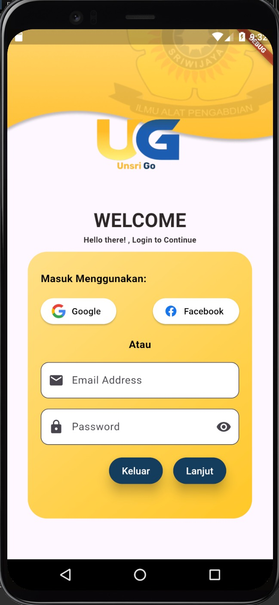
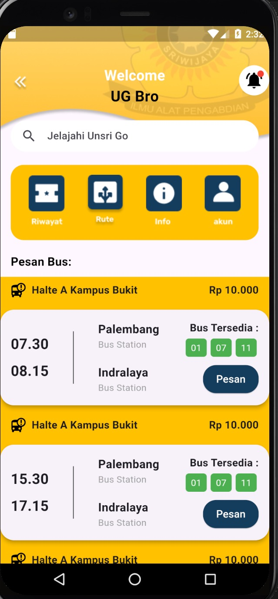
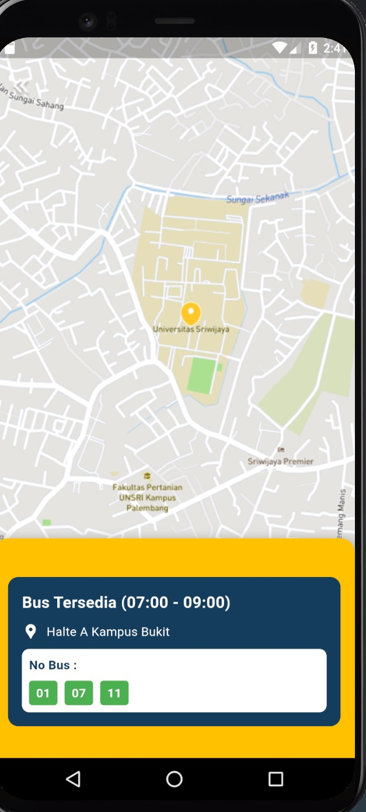
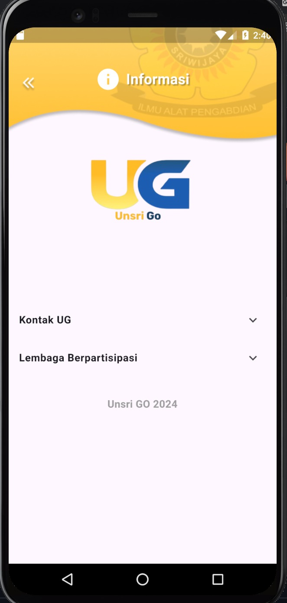
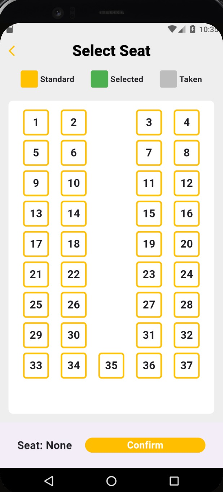
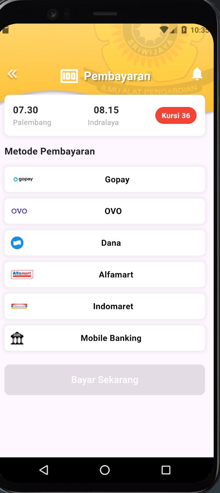
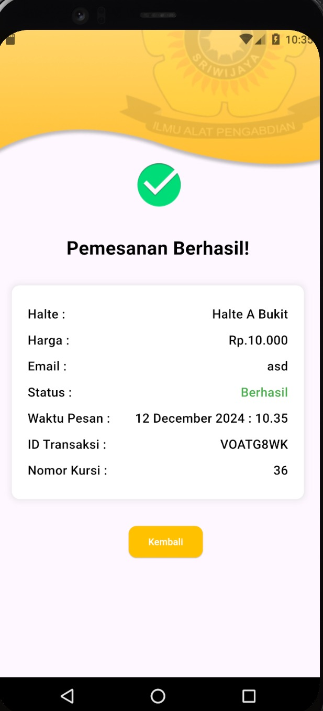
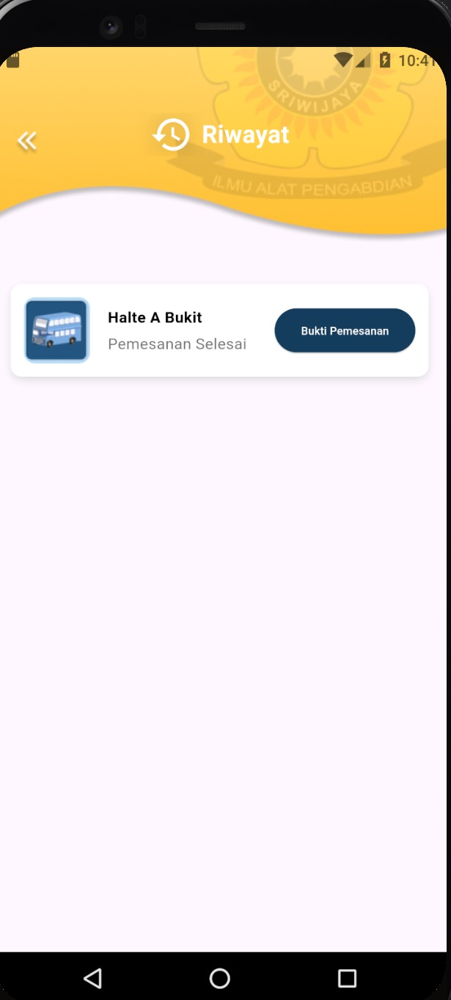
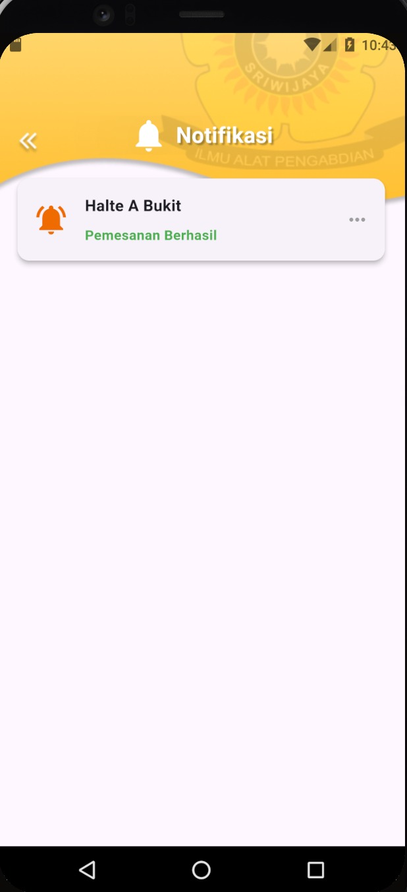

## Tampilan Aplikasi

Berikut adalah tampilan dari aplikasi Flutter yang telah dibuat:

LoginPage :

Pada laman ini pengguna diminta untuk masuk menggunakan email dan password mereka sebelum memasuki aplikasi.

Home Page:

Pada Laman ini melampirkan halaman utama aplikasi ini yang berisikan
1. tombol rute bus aplikasi

2. tombol informasi aplikasi

3. tombol akun pengguna

Proses Transaksi Aplikasi
1. Pengguna memilih waktu dan halte bus dari tampilan homepage

2. Pengguna memilih kursi duduk yang ditampilkan oleh sistem

3. Pengguna memilih metode pembayaran dalam pemesanan tiket bus

4. Sistem menampilkan nota transaksi pemesanan pengguna 

5. sistem menampilkan riwayat transaksi pada menu riwayat yang ada pada laman utama aplikasi

6. aplikasi mengirimkan notifikasi pada pengguna bahwa pemesanan berhasil

